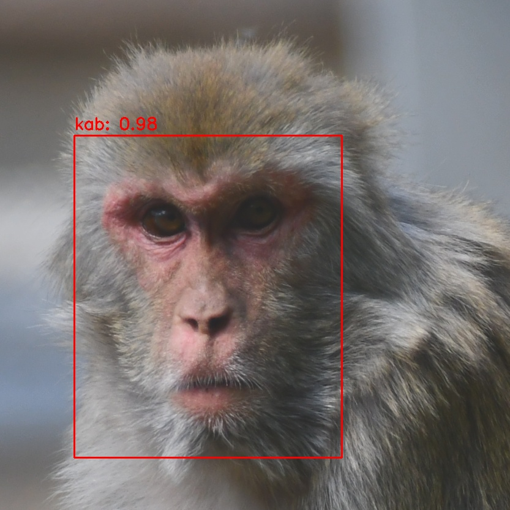

# MFID (MonkeyFaceID) - Comprehensive User Guide

## 1. Introduction

Welcome to the MFID (MonkeyFaceID) System!

MFID is a powerful and user-friendly application designed for researchers, ecologists, and enthusiasts who work with image and video data. While its name comes from primate research, its tools are versatile enough to be trained for a wide variety of tasks, like identifying different animal species, tracking individuals, or even classifying fruits!

Think of MFID as a complete digital lab assistant. It helps you with the entire workflow of computer vision:

*   **Organizing Your Data:** Sort and label thousands of images with easy-to-use annotation tools.
*   **Training AI Models:** Teach the computer to recognize what's in your images by creating your own custom AI models. No coding required!
*   **Analyzing Your Media:** Automatically process folders full of images and videos to detect objects, classify them, and get detailed reports.

This guide will walk you through every step, from installation to analyzing your first dataset.

## 2. Installation

Getting MFID set up on your computer is a straightforward process. Follow these steps carefully.

### 2.1. System Requirements

*   **Operating System:** Windows, macOS, or Linux.
*   **Python:** You'll need Python installed. Version 3.8 or newer is recommended.
*   **Hardware:**
    *   A modern computer is sufficient for most tasks.
    *   For training new AI models, a powerful computer with a dedicated **NVIDIA Graphics Card (GPU)** is **highly recommended**. Training on a GPU can be 10 to 50 times faster than on a standard computer processor (CPU).
    *   **Apple Silicon Users (M1/M2/M3):** The application runs efficiently on Apple Silicon, leveraging the MPS backend for accelerated model training and inference.

### 2.2. Installation Steps

1.  **Download the Project:**
    First, you need to get the MFID project files onto your computer. If you have `git` installed, you can run this command in your terminal:
    ```bash
    git clone https://github.com/quentinbacquele/mfid.git
    cd mfid
    ```
    If you don't use `git`, you can download the project as a ZIP file from the GitHub page and unzip it.

2.  **Set Up a Virtual Environment (Highly Recommended):**
    This step is crucial. It creates a dedicated, clean workspace for MFID so it doesn't interfere with other Python software on your computer. We will name the environment `mfid_venv` to avoid conflicts.

    Open your terminal in the `mfid` folder and run:
    ```bash
    # This command creates a virtual environment folder named mfid_venv
    python3 -m venv mfid_venv
    ```

3.  **Activate the Environment:**
    Before installing dependencies, you must "activate" the environment.

    *   **On macOS or Linux:**
        ```bash
        source mfid_venv/bin/activate
        ```
    *   **On Windows:**
        ```bash
        mfid_venv\Scripts\activate
        ```
    You'll know it's active because you'll see `(mfid_venv)` at the beginning of your command prompt.

4.  **Install Dependencies:**
    With the virtual environment active, install the required packages. You can use either `uv` (faster) or `pip`.

    *   **Using `uv` (Recommended):**
        ```bash
        # Install uv if you don't have it
        pip install uv
        # Install the package in editable mode and its dependencies
        uv pip install -e .
        uv pip install -r requirements.txt
        ```
    *   **Using `pip`:**
        ```bash
        pip install -e .
        pip install -r requirements.txt
        ```

That's it! MFID is now installed.

## 3. Launching the Application

To run the MFID application, you have two primary methods.

### Method 1: Activate the Environment (Recommended)

This is the standard and easiest way.

1.  Make sure your `mfid_venv` virtual environment is active (you see `(mfid_venv)` in your terminal prompt).
2.  Run the launch command:
    ```bash
    mfid run
    ```

### Method 2: Direct Execution (Without Activating)

If you prefer not to activate the environment every time, you can call the executable directly.

*   **On macOS or Linux:**
    ```bash
    ./mfid_venv/bin/mfid run
    ```
*   **On Windows:**
    ```bash
    .\mfid_venv\Scripts\mfid.exe run
    ```

This will open the main MFID window, which acts as a launchpad for all the different tools in the suite.



From here, you can access all the modules: **Analysis**, **Detection**, **Identity**, **Training**, and **Settings**.

## 4. The MFID Application Suite

The MFID suite is composed of several specialized modules, each designed for a specific part of the computer vision workflow.

### 4.1. Analysis App

The Analysis App is your central hub for processing large amounts of data. After you have a trained model, this is the tool you'll use to put it to work. It can perform three different types of jobs.

**How to open:** Click the "Analysis" button in the main MFID toolbar.

**Main Features:**

*   **Input:** You can choose to process a single file, a selection of multiple files, or an entire folder of images and videos.
*   **Output:** All results from an analysis run are saved neatly in a designated output folder.
*   **Analysis Modes:** You can choose one of three powerful analysis modes.

#### 4.1.1. Analysis Mode: Classification

*   **What it does:** This mode takes an image and tells you what it is, based on a classification model you provide. For example, it can look at a picture and decide if it's an "Apple" or a "Pear".
*   **When to use it:** Use this when your goal is to assign a single label to each image.
*   **Output:** It generates a summary file (`classification_summary.txt`) listing each filename and its predicted category with a confidence score.

#### 4.1.2. Analysis Mode: Detection

*   **What it does:** This mode scans images or videos to *find* and draw bounding boxes around objects of interest. For example, it can find all the monkeys in a video.
*   **When to use it:** Use this when you want to locate objects within an image, not just classify the whole image.
*   **Key Options:**
    *   **Save Annotated Media:** Saves a copy of your image/video with boxes drawn on it.
    *   **Save Crops:** Saves each detected object as a separate image file. This is incredibly useful for building new datasets!
    *   **Sort Detections:** Automatically moves your source files into "positive" and "negative" folders based on whether detections were found.

#### 4.1.3. Analysis Mode: Detection + Classification

*   **What it does:** This is a powerful two-step pipeline. It first runs **detection** to find all objects of interest. Then, for each object it finds, it runs **classification** to identify it.
*   **When to use it:** This is the most advanced mode. For example, you could process a video to:
    1.  Find all the fruit (detection).
    2.  For each fruit found, decide if it's an apple or a pear (classification).
*   **Output:** It produces a detailed summary (`detection_classification_summary.txt`) that lists each detection and its corresponding classification label.

---

### 4.2. Detection App

The Detection App is a specialized tool that offers more fine-grained control over the object detection process compared to the one in the Analysis App. It is ideal for when you need to run pure detection tasks with detailed output configurations.

**How to open:** Click the "Detection" button in the main MFID toolbar.

**Main Features:**

*   **Flexible Input:** Process individual files or entire folders of images and videos.
*   **Advanced Model Handling:** Supports both standard YOLOv8 models and models from Roboflow, giving you a wider range of pre-trained and custom models to use.
*   **Rich Output Options:**
    *   **Save Annotated Media:** Generates video or image files with bounding boxes, labels, and confidence scores drawn directly on them.
    *   **Save Crops:** Automatically extracts every detected object and saves it as an individual image file, perfect for dataset curation.
    *   **Save Coordinates (TXT):** Creates a text file for each input file, containing the bounding box coordinates, class, and confidence score for every detection.
    *   **Sort Detections:** Automatically organizes your source files into `positive_detections` and `negative_detections` subfolders.
*   **Detailed Summary:** Produces a `detection_summary.txt` file that logs whether detections were found in each file and provides statistics on the number of detections per frame.

---

### 4.3. Identity App

The Identity App is a powerful Re-Identification (ReID) tool designed to recognize *individuals*. This goes a step beyond simple object detection by assigning a specific identity to each detected instance. It is perfect for tracking individual animals across videos or photo collections.

**How to open:** Click the "Identity" button in the main MFID toolbar.

**Workflow:**

The Identity App uses a sophisticated two-stage process:

1.  **Detection:** First, it uses a standard object detection model (e.g., a "monkey" detector) to find all instances of the target object in an image or video frame.
2.  **Identification:** For each detected object, it uses a second, specialized **classification model** (an "identity" model) to determine which specific individual it is (e.g., "Kabuki," "Quinoa").

**Main Features:**

*   **Individual Recognition:** Assigns specific identity labels to detected objects.
*   **Confidence Scoring:** Provides a confidence score for each identification, allowing you to gauge the certainty of the match.
*   **Result Aggregation:** When processing videos, it aggregates results across frames to provide a cumulative summary of which individuals were seen and with what confidence.
*   **Output:** Generates a detailed report (`cumulative_identity_results.txt`) listing each identified individual and their highest confidence score, as well as annotated media with identity labels.

---

### 4.4. Custom Training & Annotation App

This is where you teach the AI. This module gives you all the tools you need to create your own custom models from scratch.

**How to open:** Click the "Training" button in the main MFID toolbar.

The app is organized into two main tabs: **Image Annotation** and **YOLOv8 Training**.

#### 4.4.1. Step 1: Image Annotation

Before you can train a model, you must label your data. This is how the AI learns. You need to show it many examples.

**Prerequisite:** Select a **Data Folder** containing the images you want to label and an **Output Folder** where your trained models will be saved.

There are two ways to train, and the annotation process is different for each.

##### Annotation for a CLASSIFICATION Model

The goal is to sort images into folders. Each folder name is the label for all images inside it.
*Example: All images of "Apple" go into a folder named `apple`.*

*   **Manual Annotation:**
    1.  Click **"Launch Manual Annotator"**.
    2.  A window pops up showing one image at a time.
    3.  Type the label for the image (e.g., "Apple") and press Enter or click "Next".
    4.  The app automatically creates a folder with that label (if it doesn't exist) and moves the image into it.
    5.  This is perfect for carefully labeling images one by one.

*   **Auto-Grouping:**
    1.  If your image filenames already contain the label (e.g., `photo_of_an_apple.jpg`), you can use this shortcut.
    2.  Type a keyword (e.g., "apple") into the "Auto-Group by Keyword" box.
    3.  Click the button. The app will find all images with that keyword in their name and move them into a correctly named subfolder for you.

##### Annotation for a DETECTION Model

The goal is to draw boxes around objects in images.
*Example: In an image with three apples, you will draw three boxes, each labeled "apple".*

1.  Click **"Launch Manual Annotator"**.
2.  Check the **"Enable Bounding Box Mode"** box.
3.  For each image:
    *   Click and drag your mouse to draw a box around an object.
    *   A dialog will ask you for the label for that box.
    *   You can draw multiple boxes on a single image.
4.  When you click "Next", the app saves a special text file alongside your image that contains the coordinates and labels of all the boxes you drew.

#### 4.4.2. Step 2: YOLOv8 Training

Once your data is annotated, you are ready to train.

**Prerequisites:** Your **Data Folder** must be organized correctly from the annotation step.

1.  **Select Training Mode:** Choose whether you are training a `Classification` or `Detection` model. The app will guide you.

2.  **Configure Basic Settings:**
    *   **Model Size:** Choose the complexity of the AI. `s` (small) is a great starting point. Larger models (`m`, `l`) are more accurate but slower to train.
    *   **Epochs:** An epoch is one full training cycle through your dataset. `100` is a good starting value.
    *   **Image Size:** The size (in pixels) that your images will be resized to for training. `224` or `320` is standard for classification.
    *   **Experiment Name:** Give your training run a unique, descriptive name (e.g., `Apple_Pear_Classifier_V1`). This name will be used for the output folder.

3.  **Start Training:**
    *   Click the **"Start Training"** button.
    *   The app will first prepare your data (creating necessary configuration files) and then begin the training process.
    *   You can monitor the progress in the "Training Status" area, which shows live updates and performance metrics from the model as it learns.

4.  **Get Your Model!**
    *   When training is complete, a "Training successful" message will appear.
    *   Navigate to your chosen **Output Folder**. Inside, you will find a folder with your **Experiment Name**.
    *   The path will look something like this: `Output_Folder/classify/Your_Experiment_Name/weights/`.
    *   Inside the `weights` folder, the file `best.pt` is your new, custom-trained AI model! You can now use this model in the other apps.

---

### 4.5. Settings App

The Settings App provides a simple interface to configure global application settings.

**How to open:** Click the "Settings" button in the main MFID toolbar.

**Current Settings:**

*   **Default Output Directory:** You can set a default folder where all output files from the Analysis, Detection, and Identity apps will be saved. This saves you from having to select an output folder every time you run a process.

---

## 5. Practical Example: Training an Apple vs. Pear Classifier

Let's walk through a complete, real-world example. We will train a model to tell the difference between apples and pears using the sample images included in the `test/` folder.

### 5.1. Part 1: Organize and Annotate the Data

Our goal is to create a dataset where all apple images are in a folder named `apple` and all pear images are in a folder named `pear`.

1.  **Launch the MFID application** (`mfid run`).
2.  Open the **Custom Training & Annotation App** by clicking "Training".
3.  **Set Your Folders:**
    *   For **"Data Folder"**, click "Browse..." and select the `test` folder inside the `mfid` project directory.
    *   For **"Output Folder"**, create a new folder somewhere on your computer, for example, on your Desktop, and name it `Fruit_Models`. Select this folder.
4.  **Annotate the Images:** We'll use the **Auto-Grouping** feature since the filenames are helpful (`apple1.jpeg`, `pear1.jpeg`).
    *   Go to the "Image Annotation" tab.
    *   In the "Enter a keyword..." text box, type `apple`.
    *   Click **"Auto-Group by Keyword"**. A notification will tell you it moved 10 images.
    *   Now, type `pear` in the text box.
    *   Click **"Auto-Group by Keyword"**. It will move another 10 images.
5.  **Check Your Work:** If you look inside the `test` folder on your computer, you will now see two new subfolders: `apple` and `pear`, each containing the correct images. Our dataset is ready!

### 5.2. Part 2: Train the Classification Model

Now we'll use our organized dataset to train the classifier.

1.  In the Custom Training App, switch to the **"YOLOv8 Training"** tab.
2.  **Select Training Mode:** Make sure `Classification` is selected.
3.  **Fill in the Training Configuration:**
    *   **Model Size:** Select `s`.
    *   **Epochs:** Enter `50`. (For a simple task like this, 50 is plenty).
    *   **Image Size:** Enter `224`.
    *   **Batch Size:** `8` should be fine.
    *   **Experiment Name:** Type `Apple_vs_Pear_Classifier`.
    *   **Device:** Leave as `auto`.
4.  **Start Training:** Click the **"Start Training"** button.
5.  **Monitor Progress:** Watch the status area. You'll see the progress bar fill up and metrics appearing in the text box below. Since this is a small dataset, it should only take a minute or two, especially on a GPU.
6.  **Find Your Model:** Once it's done, navigate to the output folder you created. Inside `Fruit_Models`, you will find the final model here: `Fruit_Models/classify/Apple_vs_Pear_Classifier/weights/best.pt`.

### 5.3. Part 3: Test Your New Model

Let's use our new model to classify an image it has never seen before.

1.  **Download a new image** of an apple or a pear from the internet and save it to your computer.
2.  From the main MFID window, open the **Analysis App**.
3.  **Configure the Analysis:**
    *   **Input:** Under "Input Selection", click "Select Files..." and choose the new image you just downloaded.
    *   **Output:** Select any folder for the results.
    *   **Analysis Mode:** Make sure **Classification** is selected.
    *   **Models -> Classification Model:** This is the crucial step. Click the **"Import Model"** button. Navigate to your `best.pt` file (`.../weights/best.pt`) and select it. Your model will now appear in the dropdown list. Make sure it is selected.
4.  **Run Analysis:** Click the **"Run Analysis"** button at the bottom.
5.  **Check the Results:** The process will be almost instant. Open the output folder you selected. Inside, you'll find a `classification_summary.txt` file. Open it, and it will show the filename along with its predicted class ("apple" or "pear") and a confidence score!

Congratulations! You have successfully annotated a dataset, trained a custom AI model, and used it to make a prediction. You can follow this same process for any classification or detection task. 